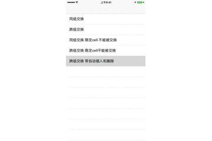
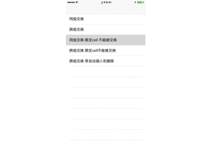
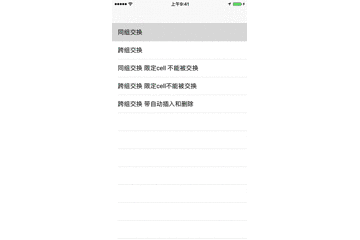
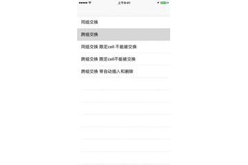

# WKCollectionViewFlowLayout 


###[联系方式-357863248@qq.com](http://www.jianshu.com/u/a492221b5126)

###**[效果展示]**

- 跨组交换带自动插入和删除


- 跨组交换 限定cell不能被交换

- 跨组交换

- 同组交换

- 同组交换 限定cell不能被交换


###**特点**####

1. 功能

	**简介：实现了cell可拖动功能的flowlaout**
	
	- cell拖动范围自由定制（同组拖动，跨组拖动，某组不能拖动）
	- 可设置指定cell不可被拖动不可被交换
	- cell拖动到section中空白无cell处后自动插入(开关isAutoInsert，默认关闭)
	- cell拖动处collecitonview有效区域自动删除(开关 isAutoDelete,默认关闭)
	- 拖动cell时至屏幕需翻页且可翻页时自动滚动 
		
2. 高度监控

	- 利用代理模式，提供了一系列的方法实时监控Cell的布局位置和数据位置
		


###集成方式

- 下载demo提取文件集成


- 现已加入cocoapods豪华午餐

```
platform :ios, '8.0'

target 'TargetName' do
pod 'WKCVMoveFlowLayout'
end
```